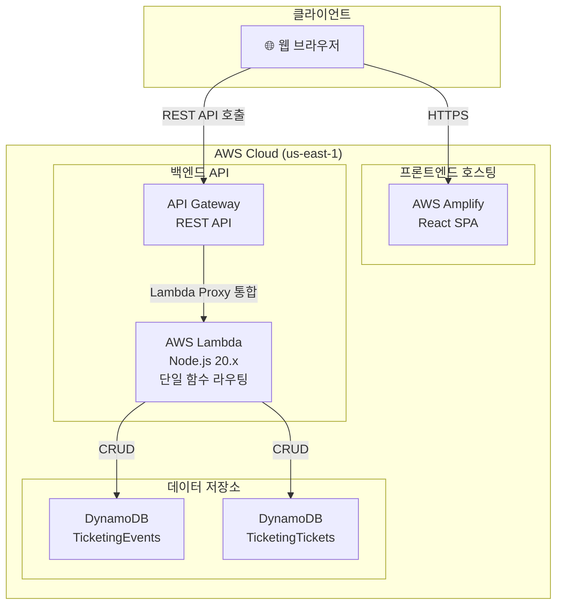
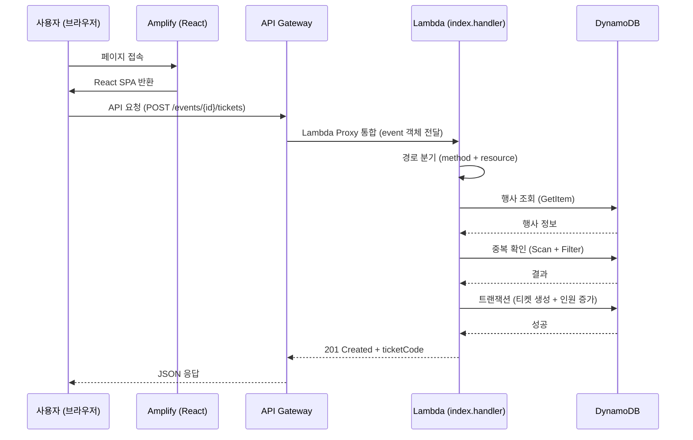
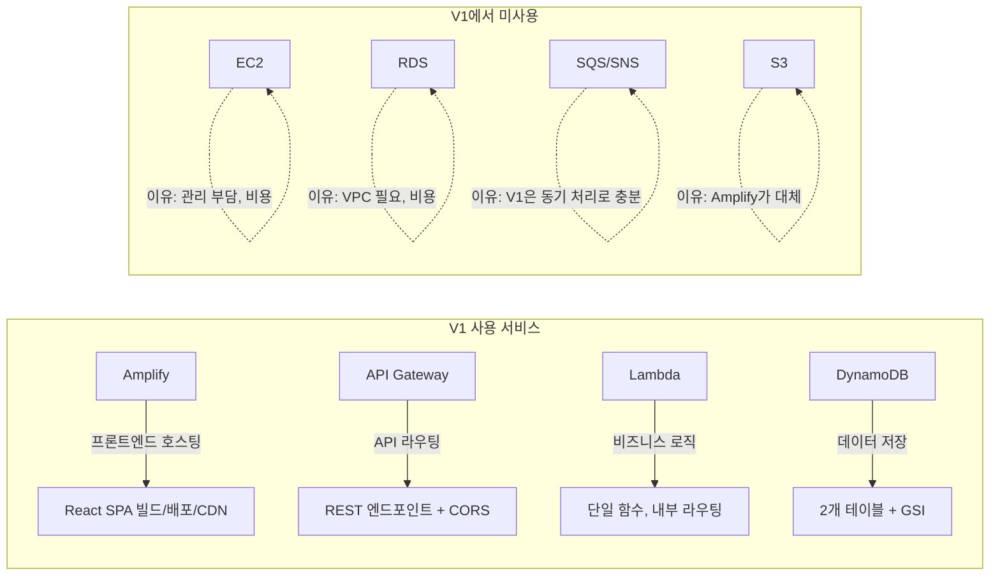

# 🎫 동아리 행사 티켓팅 및 입장 확인 시스템

KMU Cloud Computing 최종 과제 - 시나리오 4

---

## 1. 프로젝트 개요

동아리가 행사를 등록하고, 학생들이 티켓을 신청하며, 행사 당일 입장 확인 담당자가 티켓 코드로 입장 가능 여부를 검증하는 **서버리스 웹 서비스**입니다.

### 핵심 사용자

| 역할 | 설명 |
|------|------|
| 행사 주최자 | 행사 등록/수정/관리, 신청자 목록 조회 |
| 참가 학생 | 티켓 신청/취소/조회 |
| 입장 관리자 | 티켓 코드로 입장 검증 및 처리 |
| 운영자 | 전체 행사 현황 대시보드 |

---

## 2. 시스템 아키텍처 (V1)



### 요청 흐름



---

## 3. 요구사항 분석

### 3.1 기능 요구사항

| 도메인 | 요구사항 | 구현 방식 |
|--------|----------|-----------|
| 행사 등록 | 행사명, 설명, 장소, 일시, 정원, 마감시간 입력 | POST /events → DynamoDB Put |
| 행사 수정 | 모집중 상태에서만 수정 가능 | PUT /events/{id} + 조건부 업데이트 |
| 행사 상태 | 모집중→모집마감→행사종료/취소 전이 | PATCH /events/{id}/status + 상태 전이 검증 |
| 티켓 신청 | 모집중 + 마감 전 + 정원 미초과 + 중복 방지 | TransactWriteItems (원자적 처리) |
| 티켓 코드 | 신청 완료 시 8자리 영숫자 코드 발급 | 랜덤 생성 (혼동 문자 제외) |
| 티켓 취소 | 모집중 행사만, 본인 티켓만, 인원 복구 | TransactWriteItems (취소 + 인원 감소) |
| 입장 확인 | 티켓 코드로 유효성 검증 | GSI(ticketCode-index) Query |
| 입장 처리 | 유효 티켓만, 이중 입장 방지, 시간 기록 | ConditionExpression 조건부 업데이트 |
| 행사 현황 | 신청자 목록, 입장/미입장 인원 | Scan + Filter 집계 |

### 3.2 비기능 요구사항

| 항목 | 요구 | V1 대응 |
|------|------|---------|
| 가용성 | 행사 당일 안정적 서비스 | 서버리스 = AWS 관리형 고가용성 |
| 동시성 | 티켓팅 시 동시 신청 처리 | DynamoDB 트랜잭션 + 조건부 쓰기 |
| 비용 | 학교 프로젝트 수준 최소 비용 | 프리티어 내 $0 운영 |
| 확장성 | 트래픽 증가 시 자동 대응 | Lambda 자동 스케일링 |

---

## 4. AWS 서비스 선택 이유

### 4.1 왜 서버리스인가? (Lambda + API Gateway vs EC2)

| 비교 항목 | EC2 | Lambda + API Gateway |
|-----------|-----|---------------------|
| 관리 부담 | OS 패치, 보안 그룹, 스케일링 직접 관리 | **관리 불필요** |
| 비용 | 24시간 과금 (최소 ~$8/월) | **요청 시에만 과금, 프리티어 내 $0** |
| 확장성 | Auto Scaling 설정 필요 | **자동 스케일링** |
| 배포 | SSH 접속, PM2 등 프로세스 관리 | **ZIP 업로드만으로 배포** |
| 적합성 | 상시 트래픽, 장시간 처리 | **이벤트 기반, 짧은 요청 처리** ✅ |

**결론**: 동아리 행사 티켓팅은 행사 전후로만 트래픽이 발생하는 이벤트 기반 워크로드이므로, 서버리스가 비용과 관리 측면에서 최적.

### 4.2 왜 DynamoDB인가? (vs RDS)

| 비교 항목 | RDS (MySQL/PostgreSQL) | DynamoDB |
|-----------|----------------------|----------|
| 비용 | 최소 db.t3.micro ~$15/월 | **온디맨드 = 프리티어 내 $0** |
| 스키마 | 고정 스키마, 마이그레이션 필요 | **유연한 스키마** |
| 확장성 | 수직 확장 (인스턴스 크기 변경) | **수평 확장 자동** |
| Lambda 연동 | VPC 설정, 커넥션 풀 관리 필요 | **직접 연동, 설정 불필요** |
| 트랜잭션 | 완전한 ACID | **TransactWriteItems 지원** ✅ |

**결론**: 단순한 키-값 조회 패턴(eventId, ticketId, ticketCode)이 주요 접근 패턴이고, Lambda와의 자연스러운 통합 및 프리티어 무료 운영이 가능.

### 4.3 왜 Amplify인가? (vs S3 + CloudFront)

| 비교 항목 | S3 + CloudFront 수동 구성 | Amplify |
|-----------|--------------------------|---------|
| 설정 복잡도 | 버킷 정책, OAI, 배포 설정 수동 | **원클릭 배포** |
| CI/CD | 별도 구성 필요 | **GitHub 연동 시 자동 빌드/배포** |
| HTTPS | ACM 인증서 수동 발급 | **자동 HTTPS** |
| 비용 | 유사 | 유사 (프리티어 내 무료) |

**결론**: 프론트엔드 호스팅에 필요한 모든 것(빌드, 배포, HTTPS, CDN)을 한 번에 제공.

### 4.4 서비스 구성 요약



---

## 5. 데이터 모델

### TicketingEvents 테이블

| 속성 | 타입 | 설명 |
|------|------|------|
| `eventId` (PK) | String | 행사 고유 ID (UUID) |
| `organizerId` | String | 주최자 ID |
| `title` | String | 행사명 |
| `description` | String | 설명 |
| `venue` | String | 장소 |
| `eventDate` | String | 행사 일시 (ISO8601) |
| `capacity` | Number | 모집 정원 |
| `registrationDeadline` | String | 신청 마감 시간 |
| `currentCount` | Number | 현재 신청 인원 |
| `status` | String | 모집중/모집마감/행사종료/취소 |

- **GSI**: `status-index` (PK: status) — 모집중 행사 목록 조회

### TicketingTickets 테이블

| 속성 | 타입 | 설명 |
|------|------|------|
| `ticketId` (PK) | String | 티켓 고유 ID (UUID) |
| `ticketCode` | String | 입장용 8자리 코드 |
| `eventId` | String | 행사 ID |
| `studentId` | String | 학생 ID |
| `status` | String | 발급완료/입장완료/취소 |
| `issuedAt` | String | 발급 시간 |
| `enteredAt` | String | 입장 시간 |

- **GSI**: `ticketCode-index` (PK: ticketCode) — 입장 확인 시 코드 조회

---

## 6. API 엔드포인트

| Method | Path | 기능 |
|--------|------|------|
| POST | /events | 행사 등록 |
| GET | /events | 모집중 행사 목록 |
| GET | /events/{eventId} | 행사 상세 |
| PUT | /events/{eventId} | 행사 수정 |
| PATCH | /events/{eventId}/status | 상태 변경 |
| POST | /events/{eventId}/tickets | 티켓 신청 |
| GET | /tickets/my | 내 티켓 목록 |
| DELETE | /tickets/{ticketId} | 티켓 취소 |
| GET | /admission/verify/{ticketCode} | 입장 확인 |
| POST | /admission/enter/{ticketCode} | 입장 처리 |
| GET | /events/{eventId}/applicants | 신청자 목록 |
| GET | /events/{eventId}/stats | 입장 통계 |
| GET | /admin/dashboard | 운영 대시보드 |

---

## 7. 프로젝트 구조

```
├── backend/
│   ├── index.js              ← Lambda 진입점 (통합 라우터)
│   ├── handlers/
│   │   ├── events.js         ← 행사 CRUD
│   │   ├── tickets.js        ← 티켓 신청/취소/조회
│   │   ├── admission.js      ← 입장 확인/처리
│   │   └── admin.js          ← 관리자 기능
│   ├── lib/
│   │   ├── dynamodb.js       ← DynamoDB 클라이언트
│   │   ├── response.js       ← 공통 응답 헬퍼
│   │   └── auth.js           ← 인증 헬퍼
│   └── package.json
├── frontend/
│   ├── src/
│   │   ├── pages/            ← 8개 페이지 컴포넌트
│   │   ├── api/client.js     ← API 클라이언트
│   │   └── App.jsx           ← 라우팅 + 역할 전환
│   └── package.json
├── docs/
│   ├── implementation-spec.md
│   └── quick-deploy.md
└── README.md
```

---

## 8. 배포 구성

| 구성 요소 | AWS 서비스 | 설정 |
|-----------|-----------|------|
| 프론트엔드 | Amplify | GitHub 연동 또는 ZIP 수동 배포 |
| API | API Gateway | REST API, Lambda Proxy 통합, CORS |
| 백엔드 | Lambda | 단일 함수 `pj-kmucloud-4-TicketingLambda`, 핸들러 `index.handler` |
| DB | DynamoDB | 2개 테이블, 온디맨드, 테이블당 GSI 1개 |

### 비용 (프리티어)

| 서비스 | 무료 한도 | 예상 비용 |
|--------|-----------|-----------|
| Lambda | 월 100만 요청 | $0 |
| DynamoDB | 25GB, 25 WCU/RCU | $0 |
| API Gateway | 월 100만 호출 (12개월) | $0 |
| Amplify | 빌드 1000분, 15GB 호스팅 | $0 |

---

## 9. 빠른 시작

자세한 배포 절차는 [docs/quick-deploy.md](docs/quick-deploy.md)를 참고하세요.

```bash
# 백엔드 의존성 설치 후 ZIP 패키징 → Lambda 콘솔 업로드
cd backend && npm install

# 프론트엔드 빌드 → Amplify 배포
cd frontend && npm install && npm run build
```

---

## 10. V2 개선 방향 (향후)

| 영역 | V1 한계 | V2 개선안 |
|------|---------|-----------|
| 인증 | 커스텀 헤더 (보안 취약) | Cognito User Pool + JWT |
| 조회 성능 | Scan + Filter (대규모 시 느림) | GSI 추가 또는 ElastiCache |
| 알림 | 없음 | SNS/SQS로 티켓 발급 알림 |
| 모니터링 | CloudWatch 기본 | X-Ray 트레이싱 + 대시보드 |
